# 서울시 따릉이 데이터 기반 공공자전거 재배치 문제의 강화학습

이 프로젝트는 서울시 따릉이 OD 데이터를 사용해 공공자전거 재배치 문제를 강화학습 환경으로 모델링하고, 여러 재배치 정책을 비교한 과제 프로젝트이다.

핵심 결론부터 말하면, 본 실험에서 DQN이 greedy 정책을 압도하지는 못했다. 전체 reward, lost rentals, rental satisfaction 기준으로는 `Greedy District + Greedy Local`이 가장 좋은 결과를 보였다. `Global DQN`은 현재 상태 표현과 reward 구조에서 `Greedy District`보다 낮은 성능을 보였고, `Local DQN`은 대여 실패 수는 약간 많았지만 더 적은 재배치 비용으로 비슷한 만족률을 보여 이동거리 대비 효율성 측면에서 가능성을 보였다.

따라서 이 프로젝트의 결론은 특정 DQN 정책의 우월성을 주장하는 것이 아니라, 실제 따릉이 데이터를 강화학습 환경으로 구성하고, 자치구 선택과 구 내부 재배치를 분리한 계층형 의사결정 구조와 비용-성능 trade-off를 분석했다는 데 있다.

## 1. 프로젝트 개요

서울시 따릉이 대여소는 시간대와 지역에 따라 자전거 부족 또는 거치 공간 부족이 발생할 수 있다. 자전거가 부족하면 사용자는 대여하지 못하고, 거치 공간이 부족하면 재고과잉이 될 수 있다.

본 프로젝트의 목표는 다음과 같다.

- 대여 실패 수를 줄인다.
- 재고 과잉 수를 줄인다.
- 재배치 비용 proxy를 줄인다.
- 서울 전체 대여소를 대상으로 자치구 단위와 대여소 단위 의사결정을 분리한다.

강화학습으로 접근한 이유는 현재의 재배치 행동이 다음 시간대의 inventory와 이후 대여 실패에 영향을 주기 때문이다. 즉, 현재 상태에서 행동을 선택하고, 수요가 반영된 다음 상태로 넘어가며, 장기 누적 reward를 고려하는 순차 의사결정 문제로 볼 수 있다.

## 2. 제출 정보

| 항목 | 내용 |
| --- | --- |
| 학번/이름 | A74044/윤지영 |
| PPT 보고서 파일 | [results/report.pptx](results/report.pptx) |

모델 파일은 현재 repository 기준으로 다음 경로에 있다.

- `models/global_dqn_district_local_greedy.zip`
- `models/global_dqn_district_local_dqn.zip`
- `models/local_dqn/`

## 3. 데이터셋 설명

사용한 원본 데이터는 다음과 같다.

- OD 데이터: `data/raw/od/tpss_bcycl_od_statnhm_202503*.csv`
- 대여소 정보: `data/raw/stations/공공자전거 대여소 정보(25.6월 기준).xlsx`


OD 데이터에서는 날짜, 시간대, 시작 대여소 ID, 종료 대여소 ID, 이용 건수를 사용했다. 시작 대여소 기준으로 rental demand를 만들고, 종료 대여소 기준으로 return demand를 만들었다. 
대여소 정보 엑셀에서는 대여소 ID, 대여소명, 위도, 경도, 거치대 수를 사용했다. 자치구 정보는 명시 컬럼이 있으면 해당 컬럼을 사용하고, 없으면 주소/위치/대여소명 등 문자열 컬럼에서 서울시 25개 자치구명을 추출했다.


데이터는 용량문제로 구글 드라이브로 대신하였다.
https://drive.google.com/drive/folders/1ykYJoIJ-oWN6jw4ct-_POoF8maoJFH1k?usp=sharing


전처리 요약은 `data/processed/preprocess_summary.json` 기준이다.

| 항목 | 값 |
| --- | ---: |
| 사용 OD 파일 수 | 31 |
| 전체 OD row 수 | 5,362,425 |
| 사용 대여소 수 | 1,452 |
| 사용 자치구 수 | 25 |
| 시간 단위 | 30분 |
| Train timestep 수 | 1,116 |
| Test timestep 수 | 372 |
| 총 rental demand | 3,064,708 |
| 총 return demand | 3,030,344 |
| 총 capacity | 18,983 |
| 구 간 OD 비율 | 76.55% |

구 간 OD 비율은 시작 대여소와 종료 대여소가 서로 다른 자치구에 속한 OD 비율을 의미한다. 본 실험에서는 사용자의 실제 이동은 자치구를 넘을 수 있다고 보고 OD 이동을 그대로 inventory 변화에 반영했다. 다만 운영자의 재배치 행동은 같은 자치구 내부로 제한했다.

중요한 한계도 있다. OD 데이터는 실제 미충족 수요를 포함하지 않는다. 따라서 `lost rentals`는 실제 운영 로그의 실패 수요가 아니라, 관측된 OD를 demand proxy로 사용했을 때 “그 수요가 있었는데 해당 시뮬레이션 inventory로 처리하지 못했을 것”을 계산한 counterfactual simulation metric이다.

## 4. 데이터 전처리

전처리는 [src/preprocess.py](src/preprocess.py)에서 수행한다.

전처리 과정은 다음 순서로 진행된다.

1. 여러 OD CSV 파일을 읽는다.
2. 날짜/시간 컬럼을 파싱한다.
3. 30분 단위 time bin으로 집계한다.
4. 시작 대여소 기준 rental demand matrix를 만든다.
5. 종료 대여소 기준 return demand matrix를 만든다.
6. OD station ID와 대여소 정보 엑셀의 station ID를 매칭한다.
7. capacity, latitude, longitude를 추출한다.
8. haversine 거리 기반 `distance_matrix.npy`를 만든다.
9. 자치구별 metadata와 station mask를 만든다.
10. 시간순으로 train/test를 분리한다.

생성되는 주요 파일은 다음과 같다.

| 파일 | 설명 |
| --- | --- |
| `data/processed/rental_train.npy` | 학습 기간의 대여 수요 행렬 |
| `data/processed/return_train.npy` | 학습 기간의 반납 수요 행렬 |
| `data/processed/rental_test.npy` | 평가 기간의 대여 수요 행렬 |
| `data/processed/return_test.npy` | 평가 기간의 반납 수요 행렬 |
| `data/processed/capacity.npy` | 대여소별 거치 가능 자전거 수 |
| `data/processed/distance_matrix.npy` | 대여소 간 거리 행렬 |
| `data/processed/station_meta.csv` | 대여소 ID, 이름, 좌표, capacity, 자치구, 수요 요약 |
| `data/processed/district_meta.csv` | 자치구별 대여소 수, capacity, 수요 요약 |
| `data/processed/station_district.npy` | 각 station의 district ID |
| `data/processed/district_station_mask.npy` | 자치구별 station 포함 여부 |
| `data/processed/district_distance_matrix.npy` | 자치구 중심점 간 거리 행렬 |
| `data/processed/preprocess_summary.json` | 전처리 요약 정보 |

## 5. 강화학습 환경 설계

### 5.1 State

Global state는 서울 전체 자치구를 대상으로 한다.

- 시간 feature: hour sin/cos, day sin/cos
- 자치구별 inventory ratio
- 자치구별 직전 rental demand 정규화 값
- 자치구별 직전 return demand 정규화 값
- 자치구별 shortage station 비율
- 자치구별 overflow station 비율
- 자치구별 net demand feature

Local state는 특정 자치구 내부 대여소를 대상으로 한다.

- 시간 feature
- 해당 구 내부 station별 inventory ratio
- station별 직전 rental demand 정규화 값
- station별 직전 return demand 정규화 값
- 최근 3 step rolling rental demand 정규화 값
- 최근 3 step rolling return demand 정규화 값

### 5.2 Action

Global action은 자치구 선택이다.

- `0`: no-op
- `1~25`: 재배치할 자치구 선택

Local action은 선택된 자치구 내부의 station-to-station 이동이다.

- `0`: no-op
- `1~k²`: surplus 후보와 shortage 후보 pair 선택
- `k_candidates=5`이면 Local action 수는 `1 + 5 × 5 = 26`개

Local DQN이 모든 station pair를 직접 고르도록 만들면 action space가 너무 커진다. 그래서 현재 inventory ratio 기준으로 surplus 후보 k개, shortage 후보 k개만 사용했다.

### 5.3 Reward

Reward는 벌점 기반으로 설계했다.

```text
raw_penalty =
  lost_weight * lost_rentals
  + overflow_weight * overflow_returns
  + distance_weight * reposition_distance
  + imbalance_weight * imbalance_penalty

reward = - raw_penalty / max(1, rental_demand + return_demand)
```

기본 weight는 다음과 같다.

| 항목 | 값 |
| --- | ---: |
| `lost_weight` | 1.0 |
| `overflow_weight` | 0.5 |
| `distance_weight` | 0.05 |
| `imbalance_weight` | 0.1 |

Reposition Distance는 실제 재배치 차량의 주행거리가 아니라, 대여소 간 거리와 이동 자전거 수를 곱해 계산한 bike-km 성격의 재배치 비용 proxy이다.

### 5.4 Transition

각 timestep에서 먼저 재배치를 수행하고, 이후 해당 timestep의 rental demand와 return demand를 적용한다.

```text
served_rentals = min(inventory, rental_demand)
lost_rentals = rental_demand - served_rentals

accepted_returns = min(capacity - inventory, return_demand)
overflow_returns = return_demand - accepted_returns
```

마지막으로 inventory는 항상 `0 ~ capacity` 범위로 clip한다.

## 6. 알고리즘 및 Hyperparameter

학습 알고리즘은 Stable-Baselines3의 DQN을 사용했다. DQN을 사용한 이유는 action space가 자치구 선택 또는 후보 station pair 선택처럼 discrete하기 때문이다.

Local DQN은 자치구별로 독립적으로 학습하고, Global DQN 학습 중에는 frozen policy로만 사용한다. Local DQN과 Global DQN을 동시에 학습하지 않은 이유는 Local policy가 계속 변하면 Global DQN 입장에서 환경이 non-stationary해지고, 성능 변화 원인을 분리하기 어렵기 때문이다.

| 구분 | Local DQN | Global DQN |
| --- | ---: | ---: |
| `total_timesteps` | 100,000 / district | 500,000 |
| `learning_rate` | 5e-4 | 5e-4 |
| `gamma` | 0.99 | 0.99 |
| `buffer_size` | 100,000 | 200,000 |
| `learning_starts` | 5,000 | 10,000 |
| `batch_size` | 128 | 128 |
| `exploration_fraction` | 0.4 | 0.5 |
| `exploration_final_eps` | 0.05 | 0.05 |
| `net_arch` | 128,128 | 256,256 |
| `seed` | 42 | 42 |

현재 실험은 seed=42 기준이다. 여러 seed 평균, 표준편차, confidence interval은 수행하지 못했으며 한계로 남긴다.

## 7. 실험 셋업

| 항목 | 설정 |
| --- | --- |
| Train/Test split | 시간순 75% / 25% |
| Train timestep | 1,116 |
| Test timestep | 372 |
| `episode_length` | 96 |
| `trucks` | 10 |
| `truck_capacity` | 10 |
| `move_qty` | 10 |
| `k_candidates` | 5 |
| 평가 seed | 42 |

평가 지표는 다음을 사용했다.

- `total_reward`
- `total_lost_rentals`
- `rental_satisfaction_rate`
- `return_acceptance_rate`
- `total_reposition_distance_km`
- `saved_rentals_vs_no_rebalancing`
- `distance_per_saved_rental`
- `local_dqn_used_count`
- `local_greedy_fallback_count`

`No Rebalancing`은 saved rental이 0이므로 `distance_per_saved_rental`을 숫자로 비교하지 않고 `N/A`로 해석한다.

## 8. 비교 정책

1차 실험에서는 자치구 선택만 DQN이 담당하고, 구 내부 이동은 Greedy Local이 수행했다.

| 정책 | 설명 |
| --- | --- |
| No Rebalancing | 아무 재배치도 하지 않는 기준선 |
| Random District | 무작위 자치구 선택 |
| Greedy District | 부족 압력이 큰 자치구를 규칙 기반으로 선택 |
| Rule-Based District | inventory ratio와 shortage ratio 조건으로 자치구 선택 |
| Global DQN + Greedy Local | DQN이 자치구 선택, 구 내부 이동은 greedy |

2차 계층형 실험에서는 Local DQN을 먼저 학습한 뒤 frozen policy로 사용했다.

| 정책 | 설명 |
| --- | --- |
| No Rebalancing | 아무 재배치도 하지 않는 기준선 |
| Greedy District + Greedy Local | 자치구 선택과 구 내부 이동 모두 greedy |
| Global DQN + Greedy Local | 자치구 선택은 DQN, 구 내부 이동은 greedy |
| Greedy District + Local DQN | 자치구 선택은 greedy, 구 내부 이동은 Local DQN |
| Global DQN + Local DQN | 자치구 선택과 구 내부 이동 모두 DQN |

## 9. 1차 실험 결과: District-level DQN

1차 구조는 다음과 같다.

```text
서울 전체 자치구 상태
→ Global DQN 또는 baseline이 재배치할 자치구 선택
→ 선택된 자치구 내부에서는 Greedy Local rule 실행
→ rental/return demand 적용
→ reward 계산
```

결과는 `results/tables/district_only_baseline_comparison.csv` 기준이다.

| Policy | Total Reward | Lost Rentals | Rental Satisfaction | Return Acceptance | Reposition Distance | Saved vs No Rebalancing | Distance / Saved Rental |
| --- | ---: | ---: | ---: | ---: | ---: | ---: | ---: |
| No Rebalancing | -57.60 | 198,323.5 | 77.26% | 78.06% | 0.0 km | 0.0 | N/A |
| Random District | -55.46 | 193,828.5 | 77.78% | 78.61% | 44,340.9 km | 4,495.0 | 9.86 |
| Greedy District | -54.93 | 192,486.0 | 77.93% | 78.77% | 55,219.4 km | 5,837.5 | 9.46 |
| Rule-Based District | -56.00 | 195,376.0 | 77.60% | 78.41% | 26,049.3 km | 2,947.5 | 8.84 |
| Global DQN + Greedy Local | -56.51 | 195,353.0 | 77.60% | 78.41% | 30,507.0 km | 2,970.5 | 10.27 |

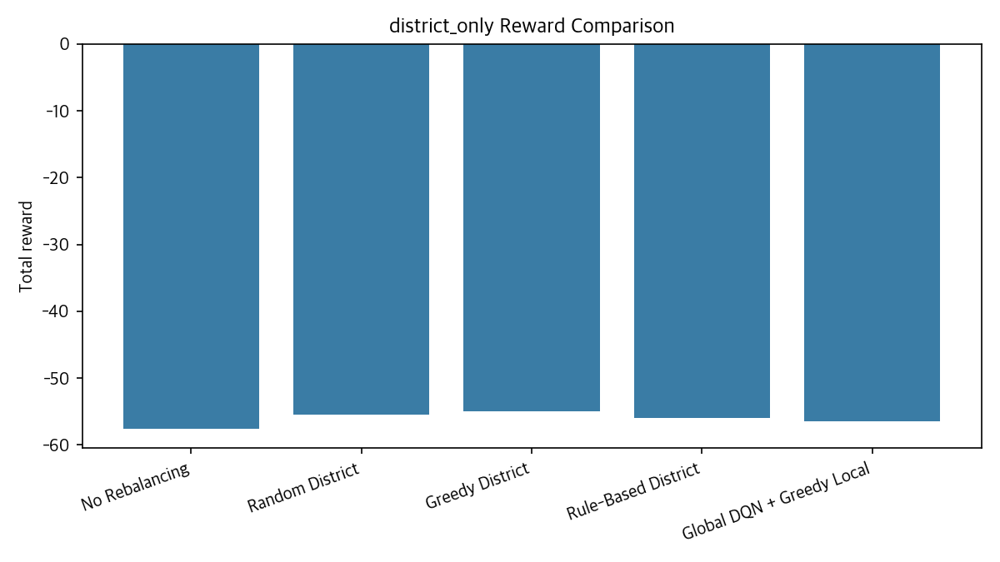

Global DQN + Greedy Local은 No Rebalancing보다 total reward와 lost rentals를 개선했다.

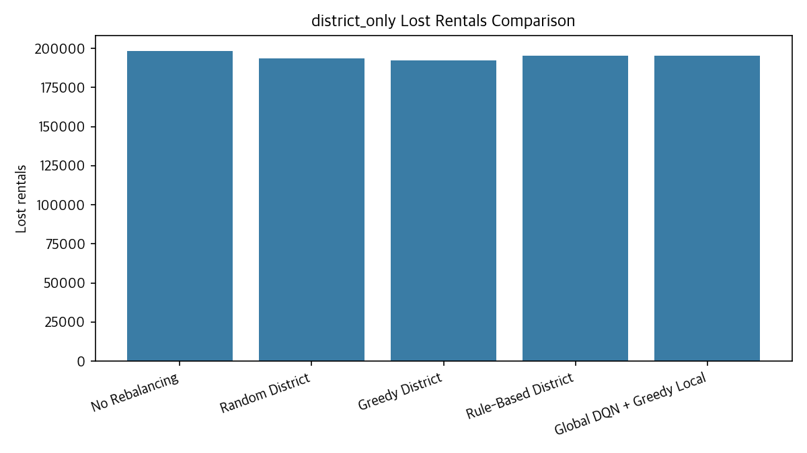

하지만 Greedy District와 비교하면 lost rentals가 2,867.0건 더 많았다. 즉, 현재 Global DQN은 greedy보다 자치구 선택을 안정적으로 잘했다고 보기 어렵다.

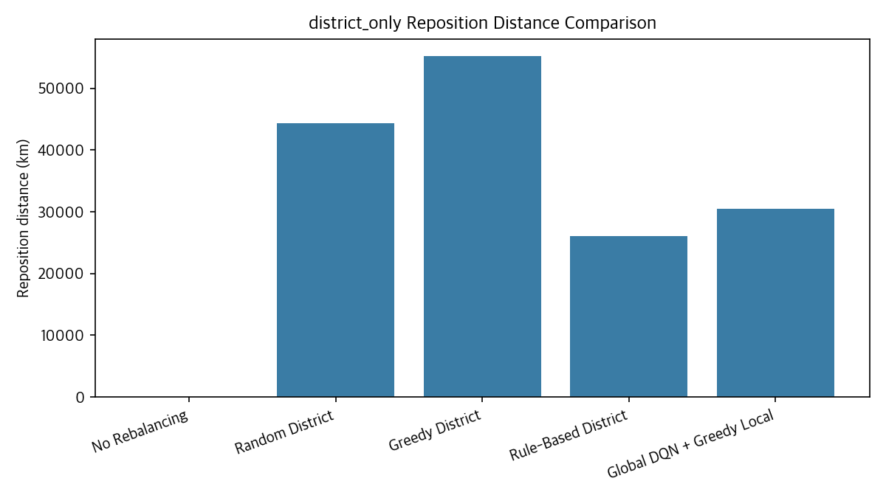

Global DQN은 Greedy District보다 적은 재배치 비용 proxy를 사용했지만, lost rentals 증가 때문에 전체 성능에서는 뒤처졌다.

1차 실험의 한계는 DQN이 자치구만 선택하고 구 내부 station-to-station 이동을 직접 학습하지 못했다는 점이다. 실제 대여 실패는 자치구 내부 특정 대여소에서 발생하므로, 구 내부 decision도 학습할 필요가 있다고 판단했다.

## 10. 2차 실험 결과: Global DQN + Frozen Local DQN

2차 실험에서는 각 자치구별 Local DQN을 먼저 학습하고, 이를 frozen policy로 고정한 뒤 Global DQN을 학습했다.

```text
Local DQN 자치구별 학습
→ Local DQN frozen
→ Global DQN이 자치구 선택
→ 선택된 구 내부에서 Frozen Local DQN 실행
→ 서울 전체 reward 계산
```

결과는 `results/tables/hierarchical_baseline_comparison.csv` 기준이다.

| Policy | Total Reward | Lost Rentals | Rental Satisfaction | Return Acceptance | Reposition Distance | Saved vs No Rebalancing | Distance / Saved Rental | Local DQN Used | Fallback |
| --- | ---: | ---: | ---: | ---: | ---: | ---: | ---: | ---: | ---: |
| No Rebalancing | -57.60 | 198,323.5 | 77.26% | 78.06% | 0.0 km | 0.0 | N/A | 0 | 0 |
| Greedy District + Greedy Local | -54.93 | 192,486.0 | 77.93% | 78.77% | 55,219.4 km | 5,837.5 | 9.46 | 0 | 0 |
| Global DQN + Greedy Local | -56.51 | 195,353.0 | 77.60% | 78.41% | 30,507.0 km | 2,970.5 | 10.27 | 0 | 0 |
| Greedy District + Local DQN | -55.19 | 192,706.5 | 77.91% | 78.73% | 50,002.6 km | 5,617.0 | 8.90 | 3,529 | 0 |
| Global DQN + Local DQN | -56.70 | 195,490.5 | 77.59% | 78.40% | 34,501.4 km | 2,833.0 | 12.18 | 3,543 | 0 |

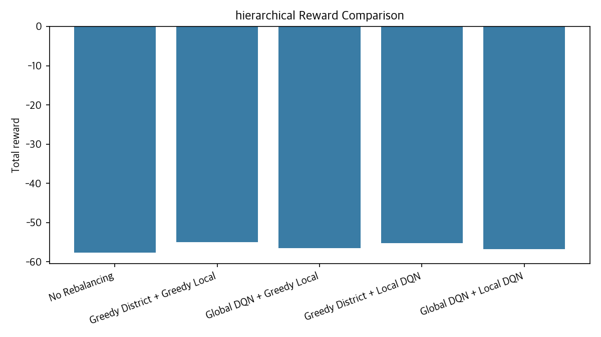

전체 reward 기준 1위는 Greedy District + Greedy Local이다.

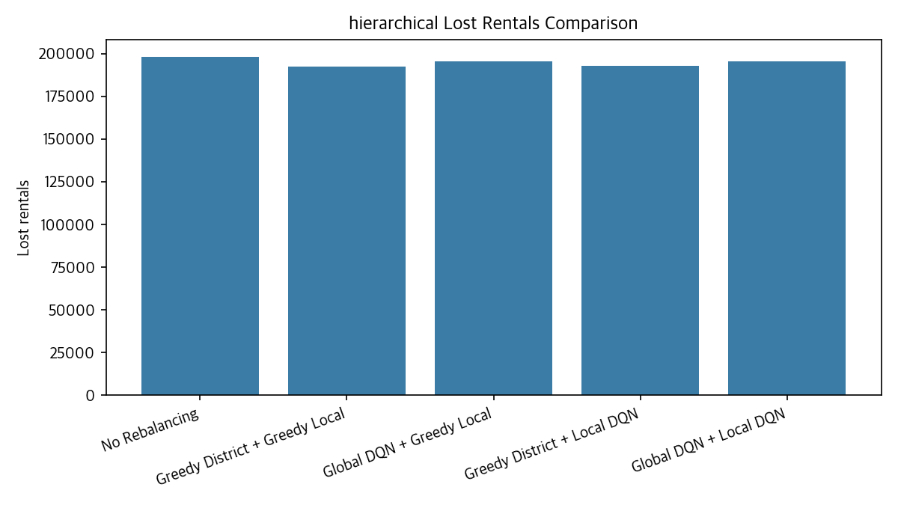

lost rentals 기준으로도 Greedy District + Greedy Local이 가장 좋았다. Global DQN 계열은 Greedy District보다 낮았다.

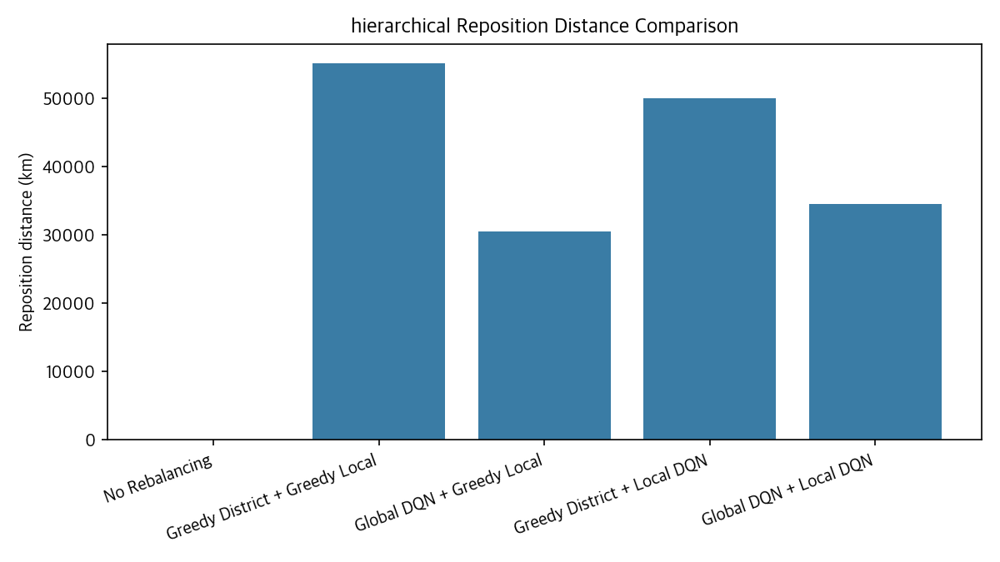

Greedy District + Local DQN은 Greedy District + Greedy Local보다 lost rentals는 220.5건 많았지만, reposition distance는 5,216.8km 적었다.

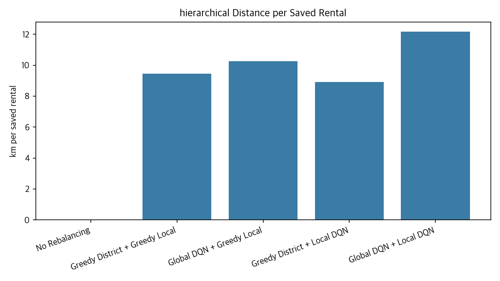

Greedy District + Local DQN은 distance_per_saved_rental이 8.90으로, Greedy District + Greedy Local의 9.46보다 낮았다. Local DQN은 대여 실패 최소화보다는 이동거리 대비 효율성 측면에서 가능성을 보였다고 해석하는 것이 적절하다.

Local DQN used count는 Local DQN이 실제로 호출된 횟수이다. `Greedy District + Local DQN`에서는 3,529회, `Global DQN + Local DQN`에서는 3,543회 호출되었다. fallback count는 0이므로, 평가에 사용된 자치구에서는 Local DQN 모델이 정상적으로 사용되었다.

## 11. 그래프 해석

### 11.1 학습 곡선

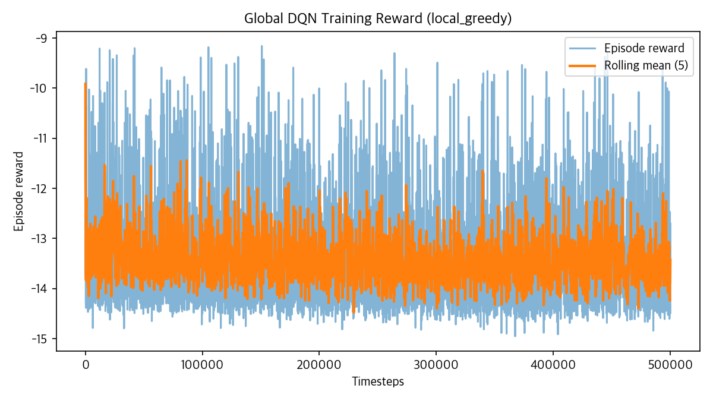

Global DQN + Greedy Local 학습 보상은 episode별 변동이 크다. 학습 reward의 개선이 최종 평가 지표에서 Greedy District를 넘는 성능으로 이어지지는 않았다.

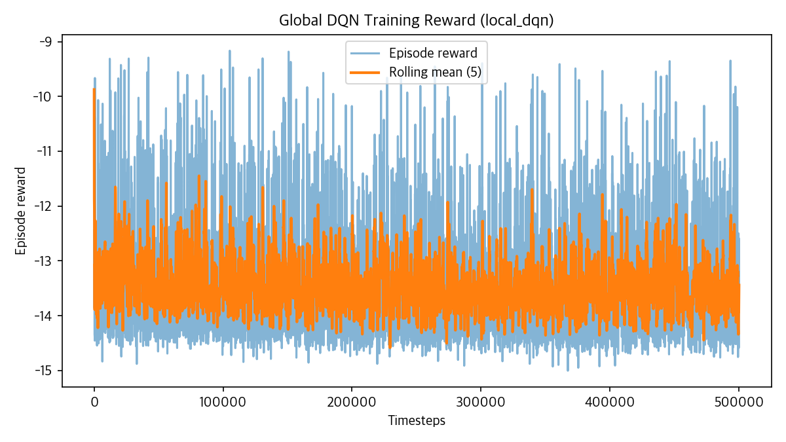

Frozen Local DQN을 포함한 Global DQN도 학습은 진행되었지만, 최종 평가에서는 Greedy District 기반 정책보다 낮았다.

### 11.2 1차 실험 그래프

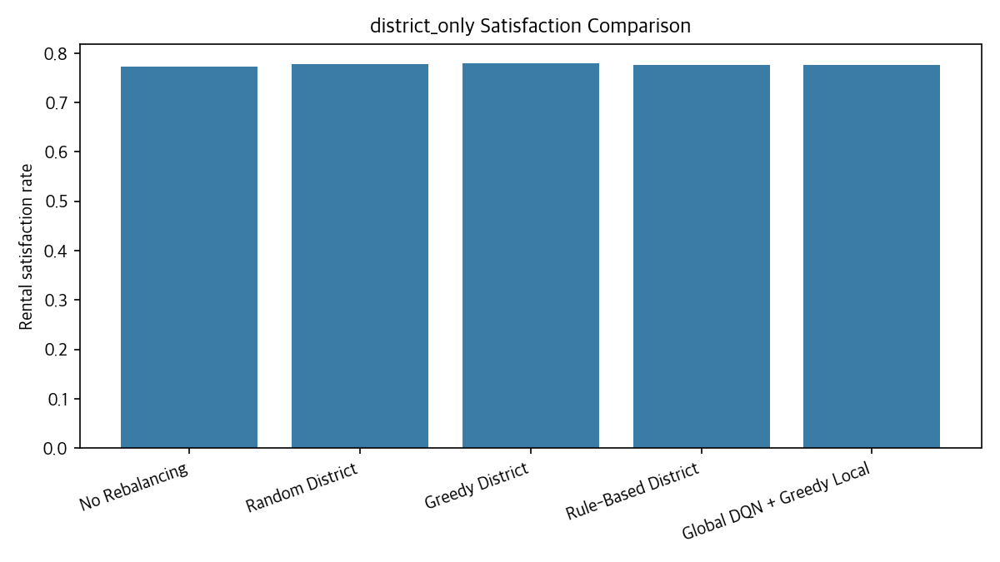

Rental satisfaction 기준으로도 Greedy District가 가장 높았다.

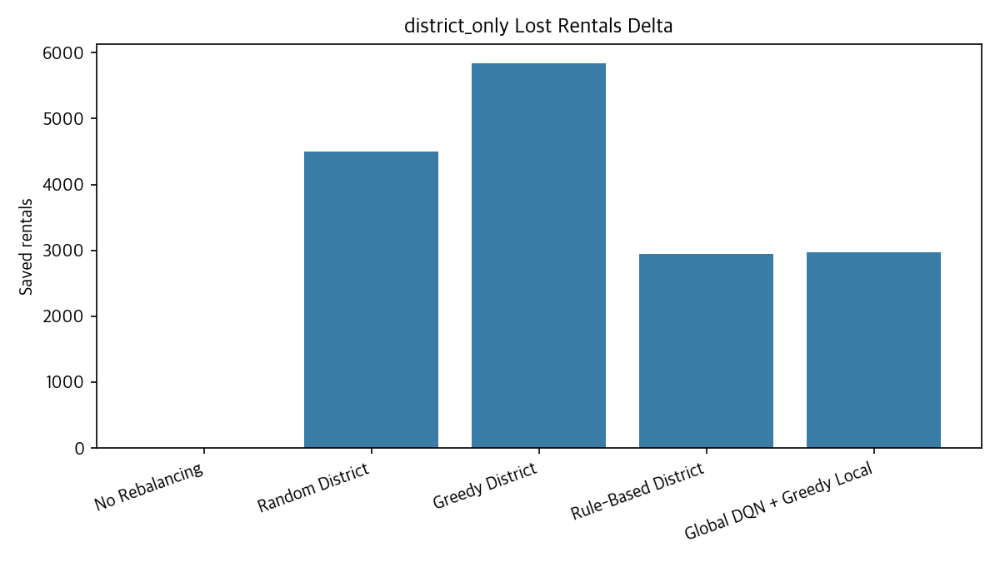

Global DQN은 No Rebalancing 대비 개선은 있었지만, Greedy District의 개선량에는 미치지 못했다.

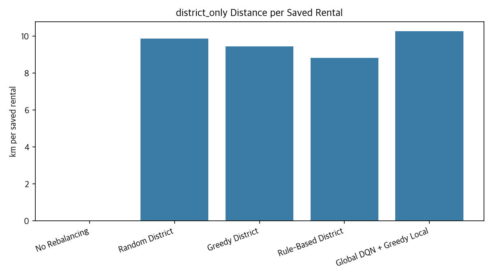

Rule-Based District는 이동거리 대비 효율은 좋지만 lost rentals 자체는 Greedy District보다 많았다.

### 11.3 2차 계층형 실험 그래프

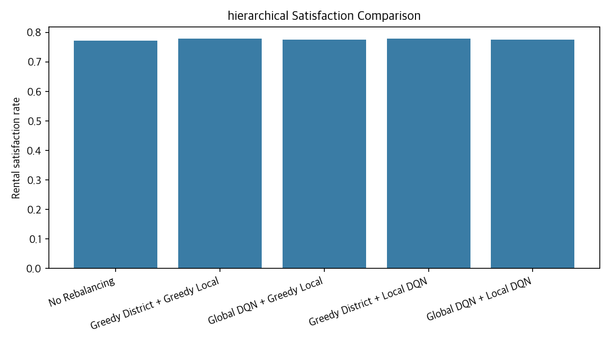

Satisfaction은 정책 간 차이가 아주 크지는 않지만, Greedy District + Greedy Local이 가장 높다.

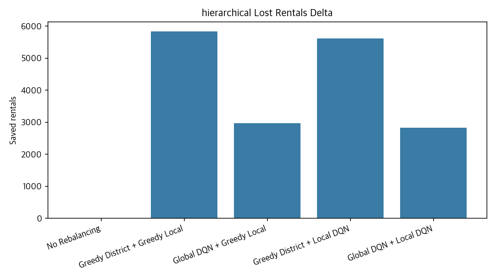

No Rebalancing 대비 lost rentals 감소량은 Greedy District 기반 정책이 DQN 기반 자치구 선택보다 컸다.

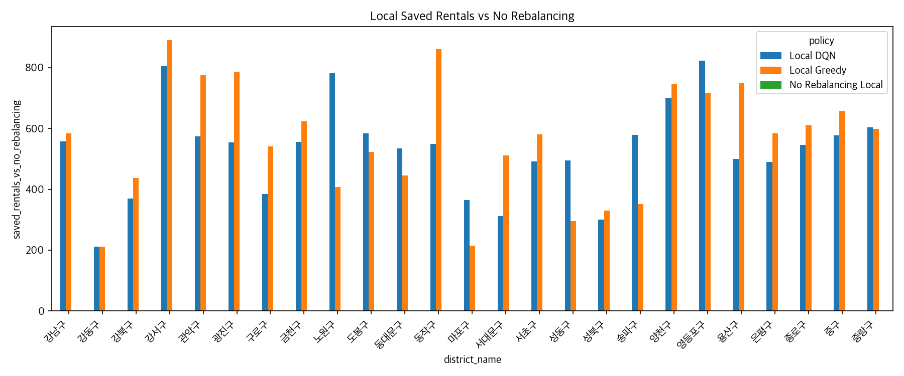

자치구별 Local DQN 성능은 균일하지 않다. 일부 구에서는 Local DQN이 greedy보다 효율적인 신호를 보였지만, 모든 구에서 일관되게 우세한 것은 아니다.

## 12. 실행 방법

### 12.1 가상환경 생성

```bash
python3 -m venv .venv
source .venv/bin/activate
python -m pip install --upgrade pip
```

### 12.2 requirements 설치

```bash
pip install -r requirements.txt
```

### 12.3 전처리

```bash
python src/preprocess.py \
  --od-glob "data/raw/od/tpss_bcycl_od_statnhm_202503*.csv" \
  --station-glob "data/raw/stations/*.xls*" \
  --freq "30min" \
  --use-all-stations \
  --zone-mode district \
  --min-station-demand 1
```

### 12.4 Local DQN 학습

```bash
python src/train_local_dqn.py \
  --processed-dir data/processed \
  --all-districts \
  --total-timesteps 100000 \
  --episode-length 96 \
  --move-qty 10 \
  --k-candidates 5 \
  --seed 42
```

### 12.5 Local DQN 평가

```bash
python src/evaluate_local_dqn.py \
  --processed-dir data/processed \
  --all-districts \
  --move-qty 10 \
  --k-candidates 5
```

### 12.6 Global DQN + Greedy Local 학습

```bash
python src/train_dqn.py \
  --processed-dir data/processed \
  --env-type district \
  --local-policy-mode greedy \
  --total-timesteps 500000 \
  --episode-length 96 \
  --trucks 10 \
  --truck-capacity 10 \
  --seed 42
```

### 12.7 Global DQN + Local DQN 학습

```bash
python src/train_dqn.py \
  --processed-dir data/processed \
  --env-type district \
  --local-policy-mode dqn \
  --local-model-dir models/local_dqn \
  --total-timesteps 500000 \
  --episode-length 96 \
  --trucks 10 \
  --truck-capacity 10 \
  --seed 42
```

### 12.8 1차 평가

```bash
python src/evaluate.py \
  --processed-dir data/processed \
  --env-type district \
  --local-policy-mode greedy \
  --model-path models/global_dqn_district_local_greedy.zip \
  --episode-length 999999 \
  --trucks 10 \
  --truck-capacity 10 \
  --experiment-name district_only
```

### 12.9 2차 계층형 평가

```bash
python src/evaluate.py \
  --processed-dir data/processed \
  --env-type district \
  --compare-hierarchical \
  --local-model-dir models/local_dqn \
  --episode-length 999999 \
  --trucks 10 \
  --truck-capacity 10 \
  --experiment-name hierarchical
```

### 12.10 전체 파이프라인 실행

[src/train_hierarchical.py](src/train_hierarchical.py)가 존재하므로 전처리 이후 전체 학습/평가를 한 번에 실행할 수 있다.

```bash
python src/train_hierarchical.py \
  --processed-dir data/processed \
  --local-total-timesteps 100000 \
  --global-total-timesteps 500000 \
  --episode-length 96 \
  --move-qty 10 \
  --k-candidates 5 \
  --trucks 10 \
  --truck-capacity 10 \
  --seed 42
```


## 13. 결과 파일 및 모델 파일

### 13.1 결과 CSV

| 파일 | 설명 |
| --- | --- |
| `results/tables/district_only_baseline_comparison.csv` | 1차 District-level DQN 평가 결과 |
| `results/tables/hierarchical_baseline_comparison.csv` | 2차 계층형 DQN 평가 결과 |
| `results/tables/baseline_comparison.csv` | 가장 최근 평가 결과 |
| `results/tables/local_dqn_training_summary.csv` | 자치구별 Local DQN 학습 요약 |
| `results/tables/local_dqn_evaluation.csv` | Local DQN과 Local Greedy 비교 결과 |
| `results/tables/global_training_log_local_greedy.csv` | Global DQN + Greedy Local 학습 로그 |
| `results/tables/global_training_log_local_dqn.csv` | Global DQN + Frozen Local DQN 학습 로그 |

### 13.2 그래프

`results/figures/*.png`에는 학습 곡선, baseline 비교, lost rentals 비교, satisfaction 비교, reposition distance 비교, distance per saved rental 비교, Local DQN 자치구별 평가 그래프가 저장되어 있다.

### 13.3 모델

| 파일 | 설명 |
| --- | --- |
| `models/global_dqn_district_local_greedy.zip` | 1차 구조에서 학습한 Global DQN |
| `models/global_dqn_district_local_dqn.zip` | Frozen Local DQN을 포함한 환경에서 학습한 Global DQN |
| `models/dqn_bike_rebalancing.zip` | 호환용 최신 DQN 모델 파일 |
| `models/local_dqn/` | 자치구별 Local DQN 모델과 metadata |

모델 파일이 GitHub 용량 제한 때문에 업로드되지 않는 경우, GitHub Release 또는 Google Drive에 모델을 올리고 README의 제출 정보에 링크를 추가해야 한다.

## 14. PPT 보고서


## 15. 한계

본 프로젝트의 한계는 다음과 같다.

- 실제 unmet demand 데이터가 없다.
- OD는 관측된 이용 이력이며 demand proxy로 사용했다.
- `lost rentals`는 실제 운영 로그의 실패 수요가 아니라 counterfactual simulation metric이다.
- 초기 inventory를 capacity의 50%로 가정했다.
- Reposition Distance는 실제 차량 routing 거리가 아니라 bike-km 비용 proxy이다.
- OD 데이터는 2025년 3월, 대여소 정보는 2025년 6월 기준이라 기준 시점 차이가 있다.
- 단일 seed 중심 실험이다.
- confidence interval을 계산하지 못했다.
- reward weight sensitivity 실험이 부족하다.
- 실제 차량 경로 최적화는 포함하지 않았다.
- 날씨, 공휴일, 계절성 feature는 반영하지 않았다.

## 16. 향후 개선 방향

- multi-seed 실험 및 confidence interval 계산
- reward weight ablation과 sensitivity 분석
- weather, holiday, 출퇴근 시간 feature 추가
- Double DQN, Dueling DQN, PPO 비교
- 여러 자치구를 동시에 선택하는 multi-action Global policy
- 자치구별 개별 Local DQN 대신 shared Local DQN 실험
- 실제 차량 routing 문제로 확장
- 실제 재고 snapshot 데이터 활용

## 17. 결론

본 프로젝트는 서울시 따릉이 데이터를 활용해 공공자전거 재배치 문제를 강화학습 환경으로 모델링하고, 자치구 선택과 구 내부 재배치를 분리한 계층형 구조를 구현하였다.

실험 결과 `Greedy District + Greedy Local`이 전체 reward와 대여 실패 수 기준으로 가장 우수했으며, `Global DQN`은 현재 상태 표현과 보상 구조에서 `Greedy District`보다 낮은 성능을 보였다. 반면 `Local DQN`은 `Greedy Local`보다 대여 실패 수는 약간 많았지만, 더 적은 재배치 비용으로 유사한 만족률을 보여 이동거리 효율성 측면에서 가능성을 보였다.

따라서 본 프로젝트의 의의는 DQN의 절대적 우월성이 아니라, 실제 도시 운영 문제에서 강화학습 환경 설계, 계층형 의사결정 구조, baseline 비교, 비용-성능 trade-off 분석의 중요성을 보인 데 있다.

